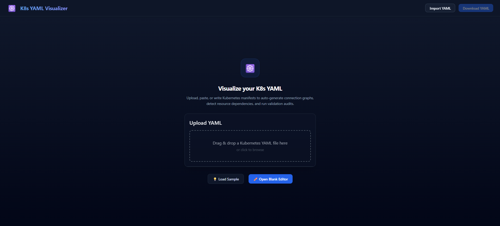
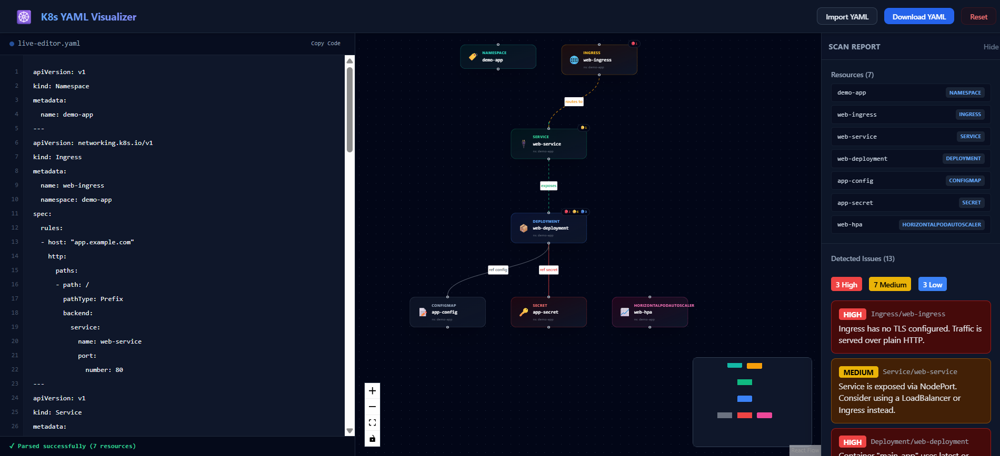
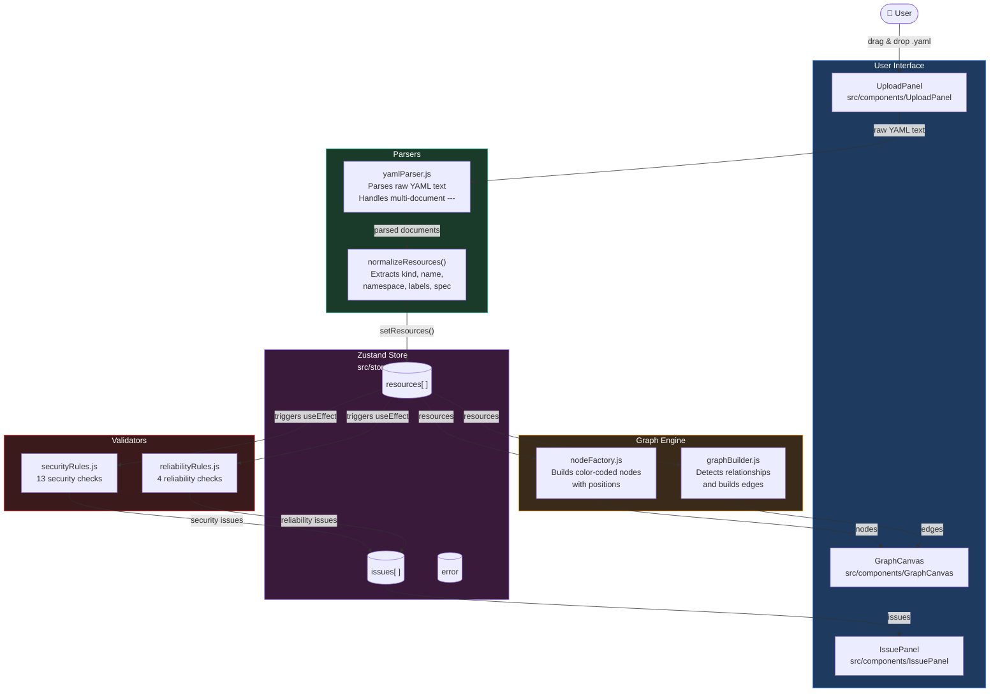

# K8s YAML Visualizer

A browser-based tool that helps developers and DevOps engineers understand Kubernetes architectures visually.

Upload a Kubernetes YAML manifest and instantly visualize resource relationships, detect security risks, and identify reliability issues all without connecting to a real cluster.



---

## Features

- **Split-Screen Live Editor** — Edit YAML configurations side-by-side with the graph canvas, with live scroll-synchronized line numbers and syntax validation.
- **Architecture Visualization** — Renders Kubernetes resources as an interactive graph with custom glassmorphic cards, type-specific icons, and severity-sorted issue warning bubbles.
- **Extended Relationship Detection** — Automatically maps connections between Ingresses, Services, Deployments/StatefulSets/DaemonSets, ConfigMaps, Secrets, PVCs, and HPAs.
- **Security Scanner** — Detects 13 common misconfigurations like privileged containers, hardcoded secrets, and missing security contexts
- **Reliability Scanner** — Warns about single replicas, missing health probes, and absent resource limits
- **Drag & Drop Import** — Import single or multi-document YAML files directly into the editor.

---

## Live Demo

🔗 [Coming soon](#)

---

## Architecture



### How it works

When a user uploads a YAML file, the data flows through four independent layers:

**1. Parser layer** — `yamlParser.js` converts raw YAML text into JavaScript objects and handles multi-document files separated by `---`. `normalizeResources()` then extracts only the fields we care about — kind, name, namespace, labels and spec.

**2. Store layer** — Normalized resources are saved into a central Zustand store. This acts as the single source of truth that all other parts of the app read from.

**3. Graph layer** — `nodeFactory.js` builds a color-coded node for each resource. `graphBuilder.js` analyzes labels and selectors to detect implicit relationships and builds the connecting edges. Both feed into the React Flow canvas.

**4. Validator layer** — Security and reliability rules run automatically whenever resources change. Each rule inspects the resource spec and pushes issues into the store. The IssuePanel reads and displays them grouped by severity.

---

## Supported Resources

| Resource | Node Color |
|---|---|
| Deployment | Blue |
| StatefulSet | Purple |
| DaemonSet | Cyan |
| Service | Green |
| Ingress | Amber |
| ConfigMap | Gray |
| Secret | Red |
| HPA | Pink |
| Job / CronJob | Lime |
| ArgoCD Application | Orange |

---

## Security Checks

| Check | Severity |
|---|---|
| Latest or untagged image tag | High |
| Privileged container | High |
| Hardcoded secret in environment variable | High |
| hostNetwork enabled | High |
| hostPID enabled | High |
| Missing ingress TLS | High |
| Missing securityContext | Medium |
| Missing resource limits | Medium |
| runAsNonRoot not set | Medium |
| readOnlyRootFilesystem not set | Medium |
| allowPrivilegeEscalation not disabled | Medium |
| NodePort exposure | Medium |
| Wildcard ingress host | Medium |

---

## Reliability Checks

| Check | Severity |
|---|---|
| Single replica deployment | Medium |
| Missing livenessProbe | Low |
| Missing readinessProbe | Low |
| Missing resource requests | Low |

---

## Tech Stack

- **React** — UI framework
- **Vite** — Build tooling
- **React Flow** — Graph visualization
- **js-yaml** — YAML parsing
- **Zustand** — State management
- **Tailwind CSS** — Styling

---

## Getting Started

### Prerequisites
- Node.js v22+
- npm

### Installation

```bash
# Clone the repository
git clone https://github.com/YOUR_USERNAME/k8s-yaml-visualizer.git
cd k8s-yaml-visualizer

# Install dependencies
npm install

# Start the development server
npm run dev
```

Open `http://localhost:5173` in your browser.

---

## Usage

1. Click the upload area or drag and drop a `.yaml` or `.yml` file
2. The graph renders automatically with your resources as nodes
3. Edges show detected relationships between resources
4. The sidebar lists all detected issues by severity

---

## Example YAML

Don't have a Kubernetes manifest handy? Use this to test:

```yaml
apiVersion: networking.k8s.io/v1
kind: Ingress
metadata:
  name: my-app-ingress
  namespace: default
spec:
  rules:
    - host: myapp.example.com
      http:
        paths:
          - path: /
            pathType: Prefix
            backend:
              service:
                name: my-app-service
                port:
                  number: 80
---
apiVersion: v1
kind: Service
metadata:
  name: my-app-service
  namespace: default
spec:
  type: NodePort
  selector:
    app: my-app
  ports:
    - port: 80
---
apiVersion: apps/v1
kind: Deployment
metadata:
  name: my-app
  namespace: default
spec:
  replicas: 1
  selector:
    matchLabels:
      app: my-app
  template:
    metadata:
      labels:
        app: my-app
    spec:
      containers:
        - name: my-app
          image: nginx:latest
          env:
            - name: DB_PASSWORD
              value: "supersecret123"
---
apiVersion: v1
kind: ConfigMap
metadata:
  name: my-app-config
  namespace: default
data:
  APP_ENV: production
---
apiVersion: v1
kind: Secret
metadata:
  name: my-app-secret
  namespace: default
data:
  DB_PASSWORD: c2VjcmV0
```

This example intentionally triggers multiple High and Medium issues to demonstrate the scanner.

---

## How the Scanner Works

Issues are not hardcoded. Every check runs dynamically against your uploaded YAML:

1. YAML is parsed into JavaScript objects
2. Resources are normalized to extract kind, name, labels and spec
3. Security and reliability rules run automatically against each resource
4. Issues are rendered in the sidebar grouped by severity

The rules define what to look for, but which resources trigger them depends entirely on your manifest.

---

## Roadmap

- [x] YAML parsing and normalization
- [x] Graph visualization
- [x] Relationship detection
- [x] Security scanning (13 checks)
- [x] Reliability scanning (4 checks)
- [x] Live YAML editor with instant graph updates
- [ ] Export diagram as PNG or SVG
- [ ] Namespace grouping on graph
- [ ] AI-powered fix recommendations
- [ ] kubeconfig cluster import

---

## What I Learned

Building this project gave me hands-on experience with:

- How Kubernetes resources relate to each other through labels and selectors
- Common Kubernetes security misconfigurations and why they matter in production
- Reliability best practices like probe configuration, replica counts and resource management
- How static analysis tools like kube-score and kube-linter work under the hood
- Graph-based UI development with React Flow
- State management patterns with Zustand in a real feature context

---

## License

MIT
